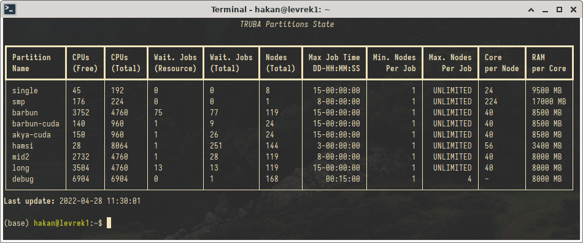

# lssrv - Küme Kuyruk Durumu Görüntüleyicisi

`lssrv`, kaynak yönetimi Slurm tarafından yapılan kümelerdeki kuyruk (partition) durumunu göstermek; kullanıcıların ve sistem yöneticilerinin sistem yükünü anlamasına ve işlerini gönderirken doğru kuyrukları seçmelerine yardımcı olmak için geliştirilmiş bir araçtır.

`lssrv`, kuyrukları ve ilgili bilgileri tablo halinde, anlaşılması kolay bir biçimde gösterir.

## lssrv'nin Özellikleri

- Sadece kullanıcının erişimi olan kuyrukları gösterir.
- Kuyruk durumu önbelleklendiği için sistem yükü oluşturmaz.
- Kümeye kurulumu ve kullanımı sistem yapılandırması değişikliği gerektirmez.
- Listede görünmesi istenmeyen bazı kuyruklar erişim izninden bağımsiz olarak gizlenebilir.

## lssrv Nasıl Çalışır?

1. `lssrv`, kullanıcının erişimi olan tüm kuyrukların bir listesini alır.
2. Genel kuyruk dosyası durumuna erişerek ilgili kuyrukardaki bilgileri toplar.
3. Bu bilgileri bir tablo haline getirerek kullanıcıya sunar.

**Not:** `lssrv`'nin ihtiyaç duyduğu kuyruk dosyası düzenli olarak `cron` tarafından çalıştırılacak bir betik ile üretilmelidir. Bu süre sistem yöneticileri tarafından belirlenebilecek olsa da, 5 dakikalık periyotların uygun olduğu gözlemlenmiştir. Üretilen bu dosyada kullanıcı bilgisi bulunmadığından, dosyanın herkes tarafından okunabilmesinin bir sakıncası yoktur.

## lssrv'nin Kurulması

`lssrv`, slrum yapılandırması üzerinde herhangi bir değişiklik yapılmadan, bir kaç dosyanın kopyalanması ile kolayca kurulabilmektedir.

### lssrv'nin gereksinimleri

- Python 3.8 veya daha üst bir sürüm.
- pip3 paket yöneticisi.
- (Opsiyonel) Sistem çapında [Rich](https://github.com/Textualize/rich) kütüphanesi kurulumu.
  - Eğer Rich sisteme kurulmaz ise, `lssrv` otomatik olarak kullanıcı altına gereken kütüphaneleri `pip3` ile kurmaktadır.

### Kurulum adımları
1. `mkdir -p /var/cache/lssrv` komutu ile `lssrv`'nin kullanacağı önbellek dizinini oluşturun. İlgili dizinin sahibini `root:root`, haklarını `755 (drwxr-xr-x)` olarak değiştirin. 
2. `/src/lssrv.py` ve `/src/lssrv` dosyalarını `/usr/local/bin` dizinine kopyalayın. Dosyaların sahibini `root:root`, haklarını `755 (-rwxr-xr-x)` olarak değiştirin.
3. `/src/cron.d/lssrv_helper` dosyasını `/etc/cron.d/` dizinine kopyalayın, sahibini `root:root`, haklarını `644 (-rw-r--r--)` olarak değiştirin.
4. `/src/conf/lssrv.conf` dosyasını `/etc/` dizinine kopyalayın, sahibini `root:root`, haklarını `644 (-rw-r--r--)` olarak değiştirin.

Cron bir kere çalıştıktan sonra `/var/cache/lssrv/squeue.state` dosyası oluşmalıdır. Dosya oluştuktan sonra `lssrv` komutunu çalıştırıp sistemi test edebilirsiniz.
