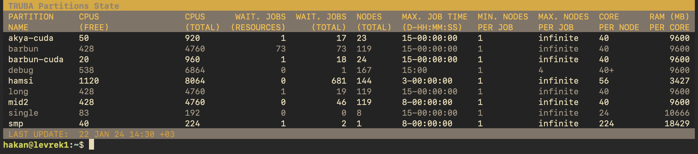

**Note:** For English version, please [scroll down](#lssrv---slurm-partition-state-summary-tool).

# lssrv - Küme Kuyruk Durumu Görüntüleyicisi
`lssrv`, kaynak yönetimi Slurm tarafından yapılan kümelerdeki kuyruk (partition) durumunu göstermek; kullanıcıların ve sistem yöneticilerinin sistem yükünü anlamasına ve işlerini gönderirken doğru kuyrukları seçmelerine yardımcı olmak için geliştirilmiş bir araçtır.

`lssrv`, kuyrukları ve ilgili bilgileri tablo halinde, anlaşılması kolay bir biçimde gösterir.

## lssrv'nin Özellikleri
- Sadece kullanıcının erişimi olan kuyrukları gösterir.
- Kuyruk durumu önbelleklendiği için sistem yükü oluşturmaz.
- Kümeye kurulumu ve kullanımı sistem yapılandırması değişikliği gerektirmez.
- Listede görünmesi istenmeyen bazı kuyruklar erişim izninden bağımsiz olarak gizlenebilir.

## lssrv Nasıl Çalışır?
1. `lssrv`, kullanıcının erişimi olan tüm kuyrukların bir listesini alır.
2. Genel kuyruk dosyası durumuna erişerek ilgili kuyrukardaki bilgileri toplar.
3. Bu bilgileri bir tablo haline getirerek kullanıcıya sunar.

**Not:** `lssrv`'nin ihtiyaç duyduğu kuyruk dosyası düzenli olarak `cron` tarafından çalıştırılacak bir betik ile üretilmelidir. Bu süre sistem yöneticileri tarafından belirlenebilecek olsa da, 5 dakikalık periyotların uygun olduğu gözlemlenmiştir. Üretilen bu dosyada kullanıcı bilgisi bulunmadığından, dosyanın herkes tarafından okunabilmesinin bir sakıncası yoktur.

## lssrv'nin Kurulması
`lssrv`, Slurm yapılandırması üzerinde herhangi bir değişiklik yapılmadan, bir kaç dosyanın kopyalanması ile kolayca kurulabilmektedir.

### lssrv'nin gereksinimleri
- [Go 1.21.5](https://go.dev/dl/) ya da daha yeni bir sürüm.
- Aktif bir internet bağlantısı.

**Not:** Geri kalan bağımlılıklar derlenme sırasında otomatik şekilde indirilecektir.

### lssrv'nin Derlenmesi
`lssrv`'nin kurulmadan önce derlenmesi gerekmektedir.

1. Eğer kurmadıysanız, [Go](https://go.dev/dl/)'nun son versiyonunu sisteminize kurun.
2. Bu kod deposunu sisteminize klonlayın ve `src/` dizinine gidin.
3. `go build lssrv.go` komutunu çalıştırın. Bağımlılıklar indirilecek ve `lssrv` derlenecektir.

### Kurulum adımları
1. `mkdir -p /var/cache/lssrv` komutu ile `lssrv`'nin kullanacağı önbellek dizinini oluşturun. İlgili dizinin sahibini `root:root`, haklarını `755 (drwxr-xr-x)` olarak değiştirin. 
2. Derlemiş olduğunuz `/src/lssrv` dosyasını `/usr/local/bin/` dizinine kopyalayın. Dosyaların sahibini `root:root`, haklarını `755 (-rwxr-xr-x)` olarak değiştirin.
3. `/src/cron.d/lssrv_helper` dosyasını `/etc/cron.d/` dizinine kopyalayın, sahibini `root:root`, haklarını `644 (-rw-r--r--)` olarak değiştirin.
4. `/src/conf/lssrv.conf` dosyasını `/etc/` dizinine kopyalayın, sahibini `root:root`, haklarını `644 (-rw-r--r--)` olarak değiştirin.
5. `/etc/lssrv.conf` dosyasını açıp gerekli değişiklikleri yapın. Dosya ile ilgili belgelendirme dosya içerisindedir.

Cron bir kere çalıştıktan sonra `/var/cache/lssrv/squeue.state` dosyası oluşmalıdır. Dosya oluştuktan sonra `lssrv` komutunu çalıştırıp sistemi test edebilirsiniz.

---

# lssrv - Slurm Partition State Summary Tool
`lssrv` is a small tool which shows the load and state of the partitions in clusters managed by Slurm resource manager and scheduler. It's designed to make the cluster state visible and understandable to system administrators and users, and aid them for making informed decisions while selecting a partition to submit their jobs.

`lssrv` shows the partitions and most relevant information about them as an easy to read and understand table.

## Features of lssrv
- It only shows the partitions which user can submit to a job.
- Works on a cached state file, so it doesn't create extra system load.
- Doesn't require Slurm or cluster configuration changes.
- Can globally hide desired partitions.

**Note:** The state file used by `lssrv` is generated by a simple cron job periodically. While the runing period of this job can be tuned by the system administrators, a 5 minute interval is good compromise between information freshness and additional overhead the job incurs. Since the created file doesn't contain username information, there's no risk users reading the state cache file.

## Installation
`lssrv` doesn't require any changes in Slurm configuration. The installation can be completed by copying the files to their respective places.

### Dependencies
- [Go 1.21.5](https://go.dev/dl/) or newer.
- A working internet connection.

**Note:** Remaining dependencies will be automatically downloaded during compilation.

### Compiling lssrv
`lssrv` needs to be compiled before installation.

1. Install the latest version of [Go](https://go.dev/dl/) if you have not already.
2. Clone this git repository and navigate to `src/` folder.
3. Run `go build lssrv.go` command. Dependencies will be downloaded and `lssrv` will be compiled.

### Installation Steps
1. Create the cache folder with `mkdir -p /var/cache/lssrv` command. Change the owner to `root:root` and permissions to `755 (drwxr-xr-x)`.
2. Copy freshly compiled `/src/lssrv` file to `/usr/local/bin/` folder. Change the owner to `root:root` and permissions to `755 (-rwxr-xr-x)`.
3. Copy `/src/cron.d/lssrv_helper` to `/etc/cron.d/`. Change the owner to `root:root` and permissions to `644 (-rw-r--r--)`.
4. Copy `/src/conf/lssrv.conf` file to `/etc/` folder. Change the owner to `root:root` and permissions to `644 (-rw-r--r--)`.
5. Open `/etc/lssrv.conf` with your favorite editor, and make required changes. The file should be self documenting.

After cron runs once, the `/var/cache/lssrv/squeue.state` file will be created. Afterwards, you can run `lssrv` command to test the tool.
